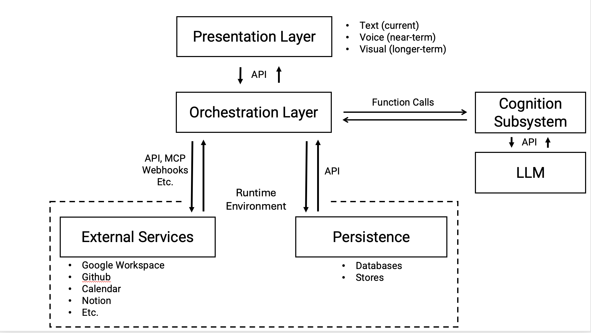

## Overview

Moneypenny is designed as a modular, extensible system whose primary purpose is to act as a reliable cognitive and operational assistant over time. The architecture emphasizes clear separation of concerns, explicit interfaces, and controlled interaction with external systems, while avoiding premature constraints on implementation or deployment.

At a high level, the system is composed of three primary subsystems—**Presentation**, **Orchestration**, and **Cognition**—operating within a shared **Runtime Environment** that provides persistence and access to external services.

---

## Presentation

The Presentation component is responsible for all user-facing interaction. It defines *how* users engage with Moneypenny, independent of how reasoning, coordination, or storage are implemented internally.

Presentation currently supports **text-based interaction**, with **voice** and **visual modalities** anticipated in future phases. All presentation modes communicate with the system exclusively through a well-defined **API boundary**, ensuring that changes in interface technology do not ripple into core system logic.

Key characteristics:

- Modality-agnostic  
- Transport-agnostic  
- Contains no business logic or cognition  
- Has no direct access to persistence or external services  

---

## Orchestration

The Orchestration component is the central coordinator of the system. It governs control flow, manages session context, enforces policies, and mediates all interaction between cognition, persistence, and external services.

Orchestration does not perform reasoning itself. Instead, it determines *what happens next* and *which capabilities are invoked*, acting as the sole gateway to the Runtime Environment.

Responsibilities include:

- Routing requests and responses  
- Enforcing constraints and permissions  
- Sequencing actions and workflows  
- Mediating access to persistence and external services  

This makes Orchestration the primary point of control for safety, auditability, and future extensibility.

---

## Cognition Subsystem

The Cognition Subsystem is responsible for interpretation, reasoning, and response generation. It transforms user input and system context into structured outputs and proposed actions.

Cognition operates as an internal subsystem, invoked via direct function calls from Orchestration. This reflects a design choice favoring simplicity, testability, and low latency in early development.

Interaction with large language models (LLMs) occurs exclusively through a clearly defined API boundary, isolating the system from vendor-specific assumptions and enabling future model substitution.

Cognition does not directly access persistence or external services. Instead, it produces structured outputs that Orchestration evaluates and executes.

---

## Runtime Environment

The Runtime Environment represents the operational substrate in which Moneypenny runs. It encompasses both internal state and external capabilities, while clearly distinguishing between what the system owns and what it depends upon.

### Persistence

Persistence provides durable internal state, including (but not limited to):

- Databases  
- Memory stores  
- Logs  
- Files  
- Vector or semantic indexes  

Persistence is treated as the system of record and is fully controlled by Moneypenny. All access is mediated by Orchestration.

### External Services

External Services include third-party systems such as:

- Google Workspace  
- GitHub  
- Calendars  
- Notion  
- Other SaaS platforms or APIs  

These services are accessed via APIs, MCP, webhooks, or similar mechanisms. They are treated as external capabilities rather than storage and are not assumed to be reliable, synchronous, or under system control.

---

## Architectural Principles

Several principles are implicit in this architecture:

- **Separation of concerns**: Interaction, coordination, cognition, and state are explicitly separated.  
- **Controlled boundaries**: Trust and capability boundaries are explicit and mediated.  
- **Minimal coupling**: Internal subsystems communicate directly; external systems are isolated behind APIs.  
- **Extensibility**: New modalities, models, services, or persistence mechanisms can be added without restructuring the system.  
- **Avoidance of rigid n-tier models**: The architecture reflects operational reality rather than legacy web-stack conventions.

---

## Role of This Architecture

This diagram and description constitute an operational view in a **system architecture**, not an implementation blueprint. They define conceptual boundaries, responsibilities, and interface relationships, while leaving room for iteration as real use cases and constraints emerge.

